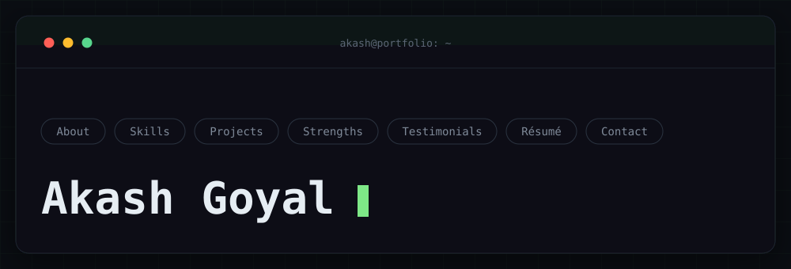
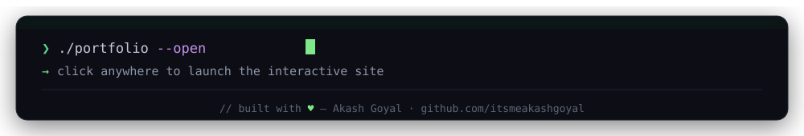

## About

- 🔧 **Focus:** Distributed Systems · System Design · Modern C++
- 🧩 **Domains:** Automotive · IoT · Blockchain · Enterprise Storage · AI
- 🚀 **Open to:** Backend / server-side roles · open source collaboration
- 📍 Bangalore, India
- 🌐 More about my work → **[itsmeakashgoyal.github.io/portfolio](https://itsmeakashgoyal.github.io/portfolio/)**

## Tech Stack

## GitHub Stats

- 📦 **26** public repositories
- 👥 **5** followers — live count in the badge above
- 🏆 Most-used language: **C++**
- 📅 On GitHub since **2017**

Snapshot, updated occasionally by hand — see the "Scaling this profile" note below for why this is plain text instead of the usual stats-card image.

## Interests

C · C++ · Data Structures · Algorithms · System Design · Distributed Systems · Linux · IoT · Blockchain · AI

<!--
Scaling this profile
=====================
files/banner.svg now contains the name, role, bio, and hashtags as requested -- that
means those specific lines require regenerating the image (via scripts or by asking for
it) if they ever change, same as any other logo/banner image. If that becomes annoying,
the fix is to move that text out of the SVG and into plain Markdown here instead, same
treatment as everything below "About" -- just say so and it's a five-minute edit.

files/footer.svg stays image-only regardless: it's just a portfolio CTA + your (stable)
name/GitHub handle, nothing in it changes.

Everything below "About" -- focus/domains/stack, stats, badges -- is plain Markdown or
an inline badge URL (shields.io / komarev). There is nothing to regenerate there:

- New skill or tool          → add one badge line under "Tech Stack"
- Focus / domains change     → edit the bullet list under "About"
- Add a social link          → copy one badge line, change the URL and label
- Refresh the GitHub Stats numbers → edit the 4 bullet points by hand

Why plain text instead of the usual github-readme-stats card image: the shared public
instance (github-readme-stats.vercel.app) returned 503 on every single check made while
building this profile -- not a one-off blip, it was down for the entire session. Rather
than link to something unreliable, the numbers above are just text.

If you want a live visual stats card instead, the standard fix is self-hosting: fork
anuraghazra/github-readme-stats, deploy it to your own free Vercel account (one click,
~5 min, needs your own GitHub/Vercel login so this isn't something that can be done for
you), then swap in two  tags pointing at your own deployment URL. That removes the
shared-instance rate limit entirely, since it's now your own quota.
-->
