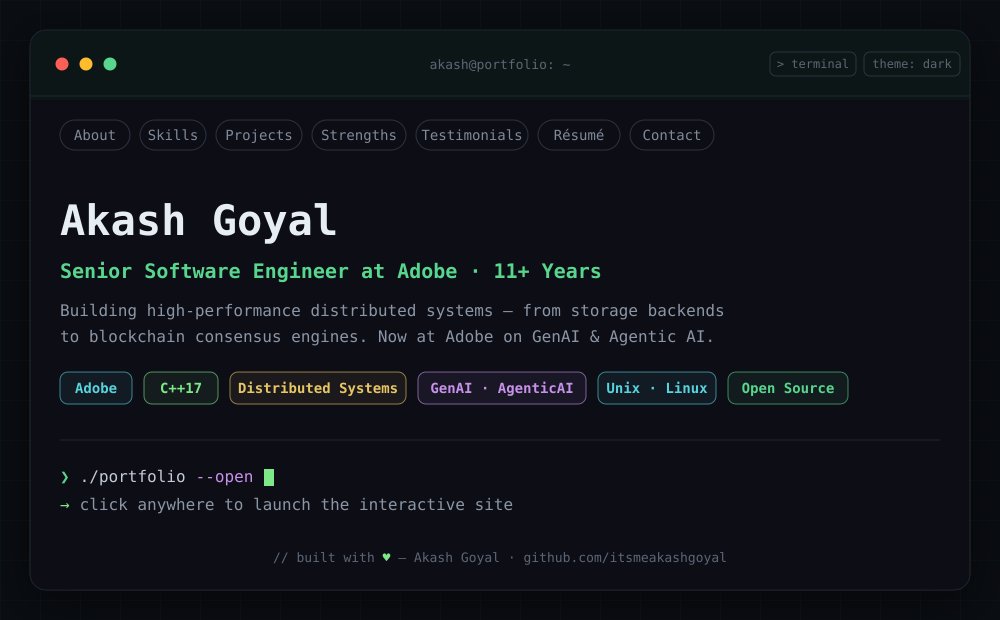

<!-- ═══════════════════════════════════════════════════════════════════════ -->
<!--            HERO  ·  portfolio landing (click → live site)                 -->
<!-- ═══════════════════════════════════════════════════════════════════════ -->

<div align="center">
  <a href="https://itsmeakashgoyal.github.io/portfolio/">
    
  </a>
</div>

<p align="center">
  <a href="https://itsmeakashgoyal.github.io/portfolio/"></a>
  <a href="mailto:ag.akgoyal@gmail.com"></a>
  <a href="https://www.linkedin.com/in/akashgoyal2309/"></a>
  <a href="https://github.com/itsmeakashgoyal"></a>
  
</p>

<br/>

## `❯` whoami

**Senior Software Engineer at Adobe** with **11+ years** building high-performance distributed systems — from storage backends to blockchain consensus engines. Deep expertise in **Modern C++**, system design, and performance. Currently working on **GenAI & Agentic AI** for Adobe Illustrator.

```text
role        Senior Software Engineer · C++ Specialist · Backend & AI
now         GenAI & Agentic AI for Adobe Illustrator @ Adobe
focus       Distributed Systems · System Design · Modern C++
domains     Automotive · IoT · Blockchain · Enterprise Storage · AI
open to     Backend / server-side roles · open source
location    Bangalore, India
```

<br/>

## `❯` cat stack.txt

```text
languages   C · C++ · Python · Shell
systems     Linux · Docker · Git · Jenkins
databases   MySQL · Oracle
strengths   Data Structures · Algorithms · Performance · System Design
```

<br/>

## `❯` git log --stat

<div align="center">
  
</div>

<br/>

## `❯` echo $INTERESTS

<div align="center">

`C` &nbsp;·&nbsp; `C++` &nbsp;·&nbsp; `Data Structures` &nbsp;·&nbsp; `Algorithms` &nbsp;·&nbsp; `System Design` &nbsp;·&nbsp; `Distributed Systems` &nbsp;·&nbsp; `Linux` &nbsp;·&nbsp; `IoT` &nbsp;·&nbsp; `Blockchain` &nbsp;·&nbsp; `AI`

</div>

<br/>

<div align="center">
  <a href="https://itsmeakashgoyal.github.io/portfolio/"><sub><code>❯ ./portfolio --open</code></sub></a>
  <br/>
  <sub>// built with ♥ — <a href="https://github.com/itsmeakashgoyal">@itsmeakashgoyal</a></sub>
</div>
