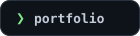
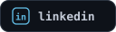
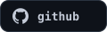
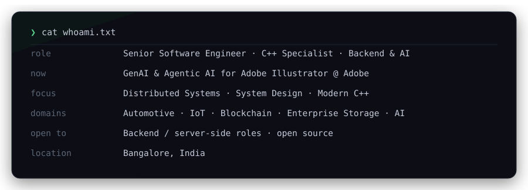
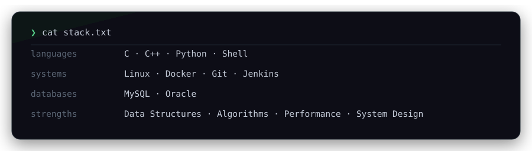
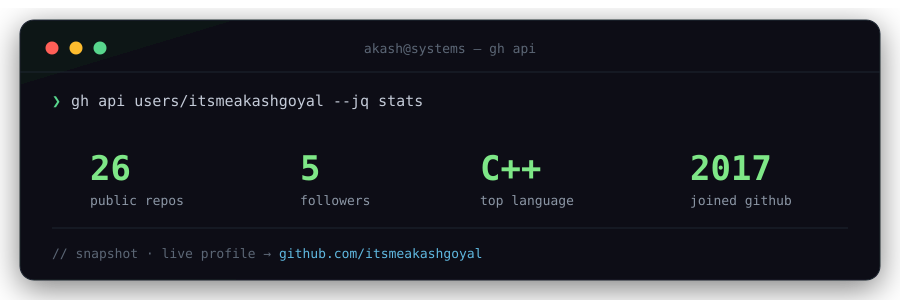
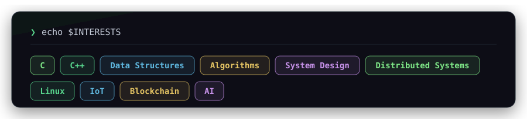

<!-- ═══════════════════════════════════════════════════════════════════════ -->
<!--            HERO  ·  portfolio landing (click → live site)                 -->
<!-- ═══════════════════════════════════════════════════════════════════════ -->

  

  
  
  
  

  
  

 

<!-- ═══════════════════════════════════════════════════════════════════════ -->
<!--   Everything below is a hand-drawn dark card, not native markdown —      -->
<!--   GitHub renders fenced code blocks / backtick tags in the viewer's      -->
<!--   own light-or-dark theme, which broke the terminal look. Images render  -->
<!--   with a fixed dark background regardless of viewer theme.               -->
<!-- ═══════════════════════════════════════════════════════════════════════ -->

  

 

  

 

  

 

  

 

  <a href="https://itsmeakashgoyal.github.io/portfolio/"><code>❯ ./portfolio --open</code></a>
   
  // built with ♥ — <a href="https://github.com/itsmeakashgoyal">@itsmeakashgoyal</a>

